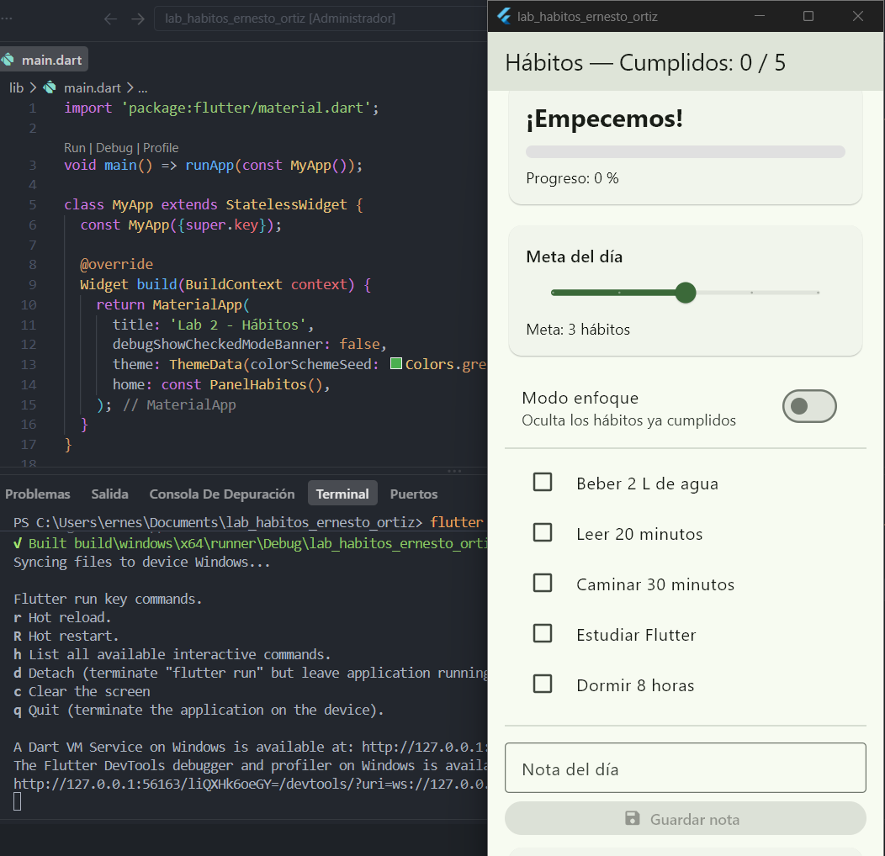
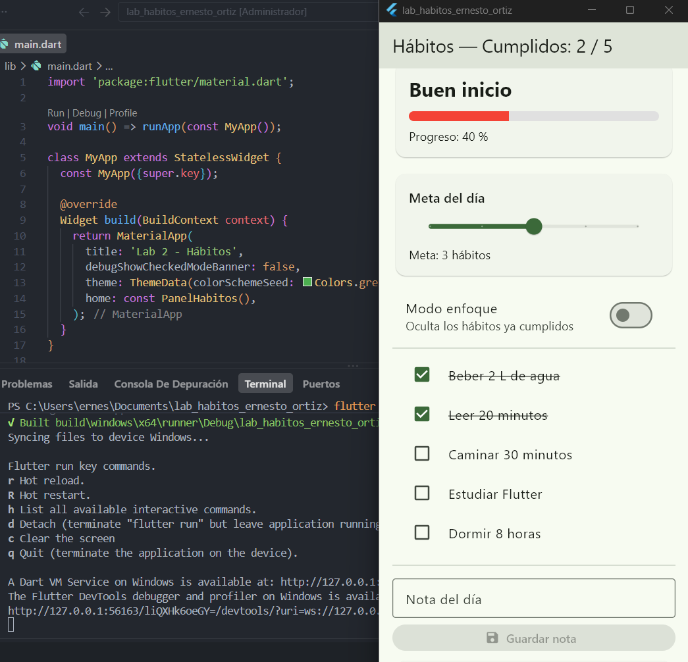
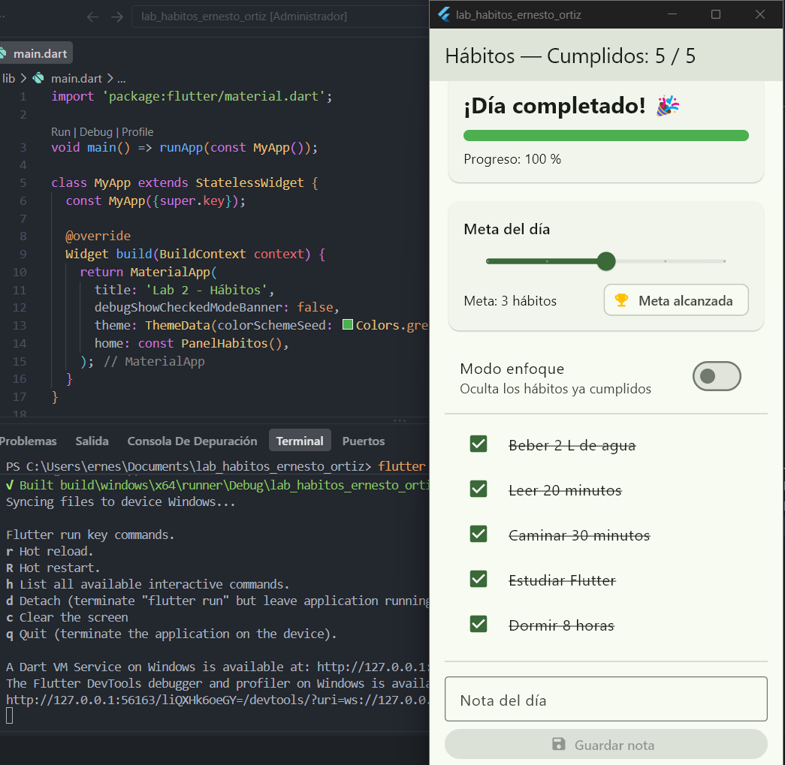
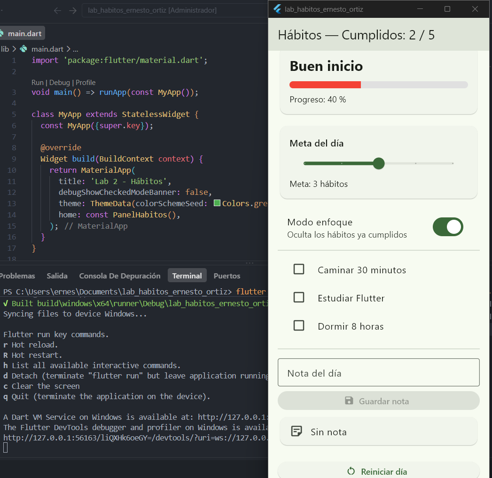
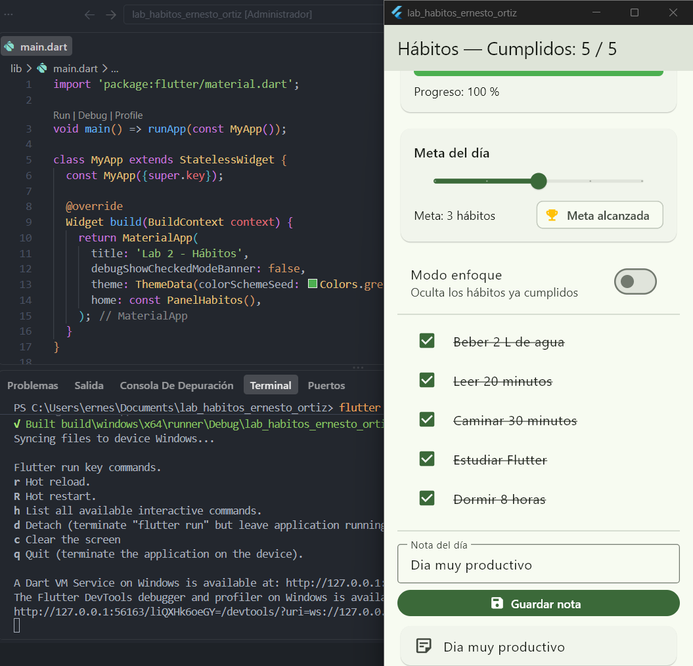
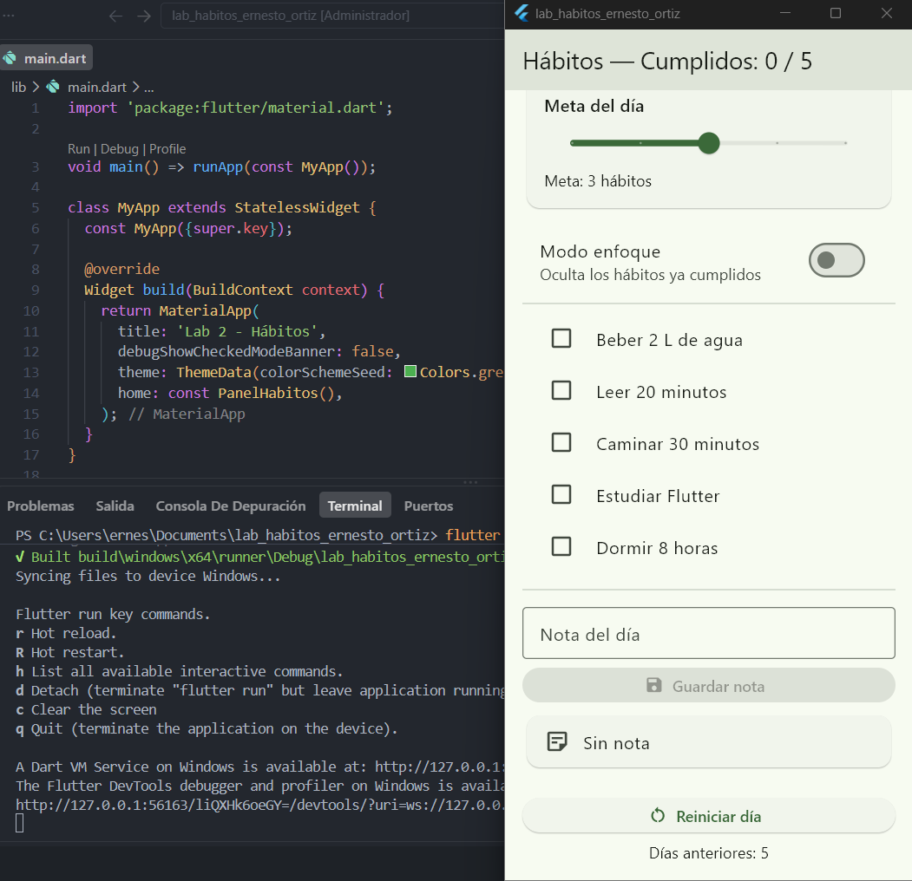

# Panel de hábitos del día — Laboratorio Semana 7

**Estudiante:** Ernesto Ortiz
**Tecnología:** Flutter 3.38 / Dart — solo `StatefulWidget` + `setState()` (sin paquetes de estado)

## Descripción

Aplicación de una sola pantalla para dar seguimiento a 5 hábitos durante el día.
Al marcar o desmarcar un hábito, toda la interfaz se actualiza al instante: el contador
del AppBar, la barra de progreso, el mensaje motivacional, el distintivo de meta y la
lista (modo enfoque). También permite fijar una meta diaria con un Slider, escribir una
nota del día y reiniciar el día.

## Variables de estado

| Variable | Tipo | Qué representa |
|---|---|---|
| `_cumplidos` | `List<bool>` | Si cada hábito está cumplido (una posición por hábito). |
| `_meta` | `int` | Cuántos hábitos me propongo cumplir hoy (Slider de 1 a 5). |
| `_enfoque` | `bool` | Si el modo enfoque está activo (oculta los cumplidos). |
| `_nota` | `String` | La nota guardada que se muestra en la tarjeta. |
| `_historial` | `List<int>` | (Extra) Hábitos cumplidos en cada día reiniciado. |
| `_notaCtrl` | `TextEditingController` | Texto del campo de nota; se libera en `dispose()`. |

**Información derivada con getters (no se guarda como estado):** `_totalCumplidos`,
`_progreso`, `_porcentaje`, `_metaAlcanzada`, `_mensaje`, `_colorProgreso`,
`_indicesVisibles`, `_campoNotaVacio` y `_textoHistorial`.

## Capturas de pantalla

| Inicio (P-10) | Progreso parcial 2/5 (P-1) | Día completado 100 % (P-2) |
|---|---|---|
|  |  |  |

| Modo enfoque (P-6) | Nota guardada (P-8) | Historial (extra) |
|---|---|---|
|  |  |  |

## Extensiones opcionales implementadas

1. **Historial:** al pulsar "Reiniciar día" se guarda el número de hábitos cumplidos y
   se muestra como "Días anteriores: 5, 3, 4".
2. **Color de la barra por tramos:** rojo (< 50 %), ámbar (< 100 %) y verde (100 %).
3. **Botón "Guardar nota" deshabilitado** mientras el campo está vacío, escuchando el
   controlador con `addListener` en `initState()` y `removeListener` en `dispose()`.
   Para la prueba P-9 (nota vacía) se borra el texto y se presiona **Enter**
   (`onSubmitted`), y la tarjeta vuelve a mostrar "Sin nota".

## Cómo ejecutar

```bash
flutter pub get
flutter run -d windows   # o: flutter run -d chrome
```

## Reflexión

El error de estado que más fácilmente pude haber cometido fue modificar una variable sin
usar `setState()`, por ejemplo escribir `_cumplidos[i] = !_cumplidos[i];` directamente en
el `onChanged` del Checkbox. En ese caso el valor cambia en memoria, pero Flutter no vuelve
a ejecutar `build()`, así que el contador, la barra y el mensaje se quedan desactualizados.
Para evitarlo, puse todas las modificaciones dentro de métodos de acción con nombres
verbales (`_alternarHabito`, `_cambiarMeta`, `_reiniciarDia`, etc.) que siempre usan
`setState()`. Otro error posible era guardar el total de cumplidos en una variable aparte,
que podía desincronizarse al desmarcar un hábito; por eso el total, el porcentaje, el
mensaje y "Meta alcanzada" se calculan con getters a partir de `_cumplidos`. Por último,
como agregué un listener al `TextEditingController`, lo quito y libero en `dispose()` y
reviso `mounted` antes de llamar a `setState()`, para no actualizar una pantalla que ya
fue destruida.
